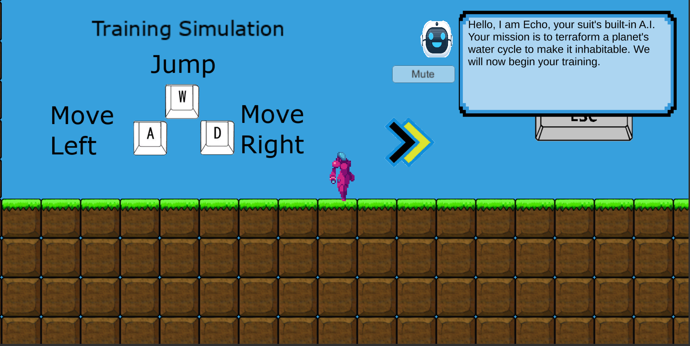
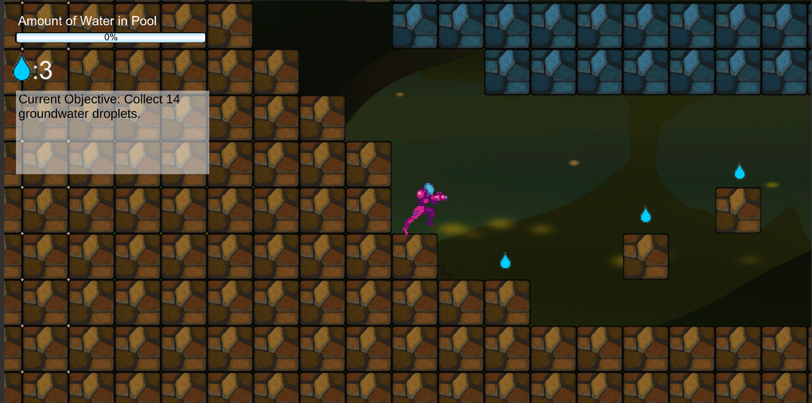
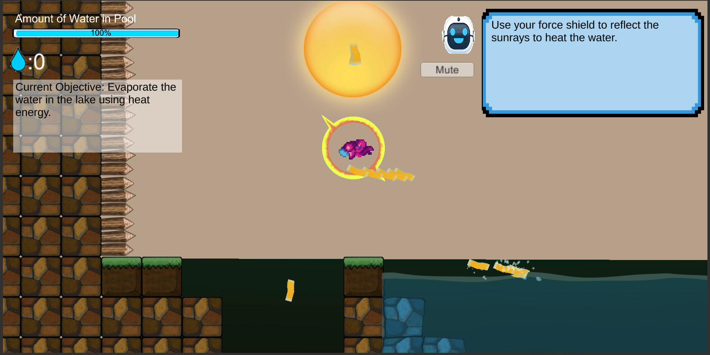
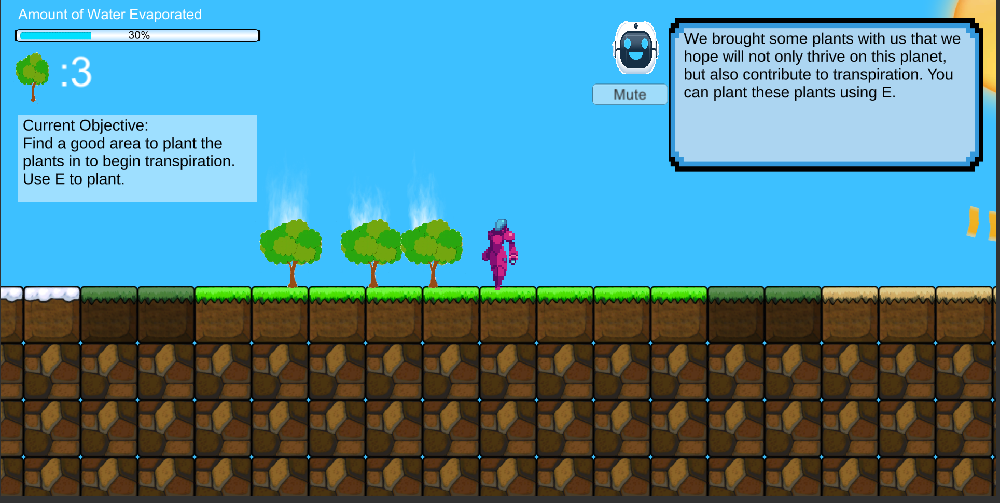
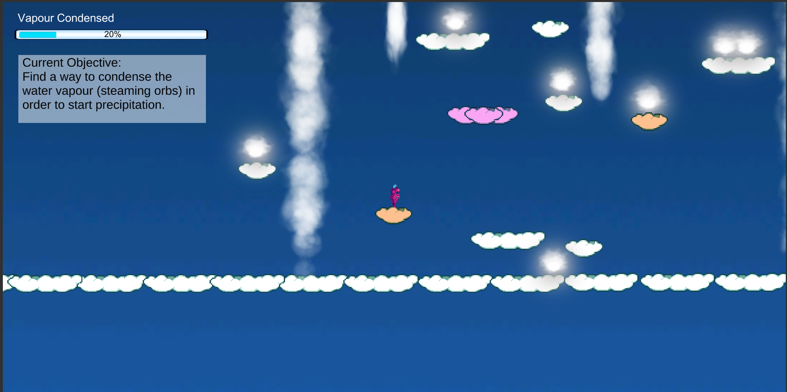
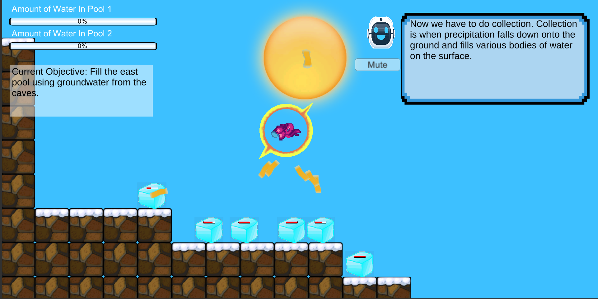
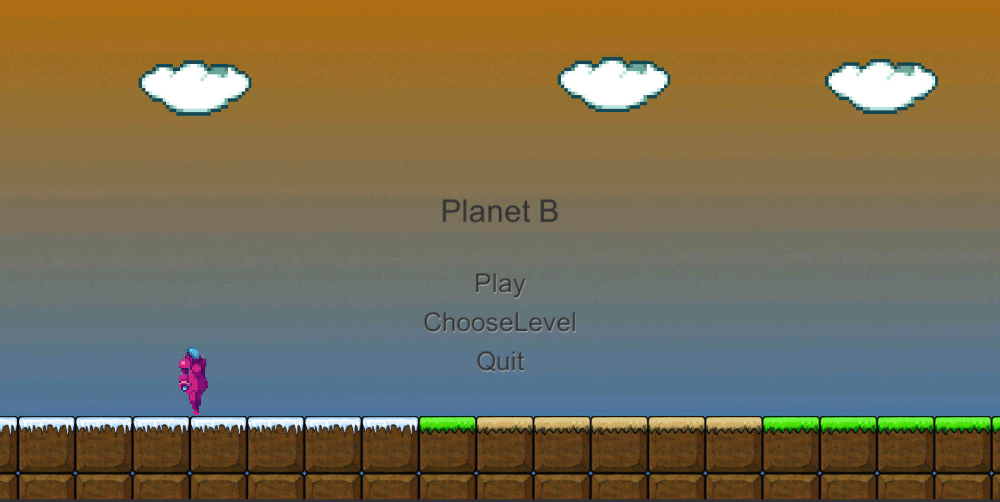
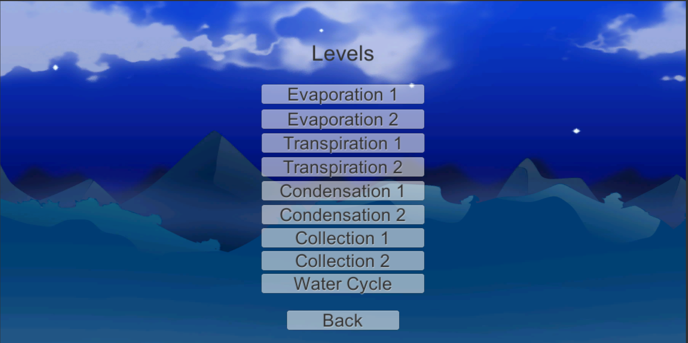

# Planet B
An educational 2D platformer about the Water Cycle. This game was made as part of a research project studying the design and implementation of educational games in high school classrooms. The study focused on identifying best design practices for educational video games and the effects of various learning strategies (repetition, zone of proximal development, situated cognition, social learning, etc.) when they are implemented in video games. 

## Summary:
The player controls a character who was tasked with fixing the water cycle on a potentially habitable planet. The player then goes through a series of puzzle like levels with the help of Echo (NPC that helps the player throughout the game by having a voice over that gives players hints and the necessary information for completing tasks) that teach the player about each separate stage of the water cycle. The last level tests the player's knowledge by asking them to implement the entire cycle on their own, with minimal hints.

## HUD:
* This differs between levels based on what the player needs to see on the HUD in any specific level.
* The top left corner displays the player's items (the amount of plants and water droplets that the player has) as well as a measure of how close they are to completing the curren tobjective. Below, there is also a small screen that displays the current objective. 
* The top right corner is reserved for Echo, a text display appears when Echo is talking, in case the player would like to read along as they listen to her.

## Player:
* The player is able to move around in two dimensions and jump as necessary.
* The player also has a weapon that they can use to destroy various obstacles found in the game.
* The player also has a reflective shield that appears when the player is near the Sun. This shield can be used by the player in order to reflect sunlight and use it to heat objects such as bodies of water or use it to melt ice.

## Items:
* The palyer is able to pick up water droplets that can be used to create surface bodies of water and plants that can be used in the process of transpiration.

## Levels:
* The learning strategy this game studied was repetition therefore each level was repeated twice with visual changes only in order to collect error free data on the impact of repetition on learning.
* Various particle systems were used to simulate realistic rain, snow, water vapour and other effects.

### Tutorial Level
* This level teaches the player the controls and presents other necessary information they need to play the game.

 
*Tutorial Level*

### Levels 1-2
* These two levels deal with the evaporation stage of the water cycle and require the player to create bodies of water and evaporation them.

 
*Collecting groundwater in level 1*

 
*Evaporating water in Level 1 by reflecting sunlight*

### Levels 3-4 
* These two levels deal with transpiration and require the player to evapoate moisture off the surfaces of plants

 

### Levels 5-6
* These levels deal with condensation and precipitation and require the player to help water vapour rise in the atmosphere in order to condense and finally precipitate.
* Since these levels are located in the atmosphere, they allow the player for more flexible movement around the level. The player can use various platforms which include moving platforms (orange), disappearing platforms (pink), pressure platforms (dark grey) to move around as well as use the air currents present in the level to quickly move up.

 
*Level 5*

 
*Gif of level 5 with all particle systems enabled*
**_Note: Gif framerate is significantly lower than the game framerate_ **

### Levels 7-8
* These two levels deal with collection, the final stage of the water cycle where water collects in surface bodies of water.

 
*Level 7*

### Level 9
* The final level where the player must implement the entire water cycle on their own in order to help tie together all of the concepts learned.

## Other Screenshots
 
*Menu*

 
*Choose Level Screen*

